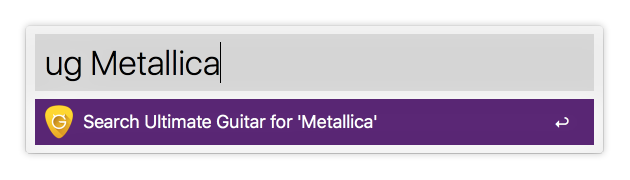

# Alfred Workflow for Ultimate Guitar
This workflow lets you search [Ultimate Guitar](http://www.ultimate-guitar.com) with the query you input. 




## Download and install
Latest version: [v0.1.0](https://github.com/simeg/alfred-workflow-ultimate-guitar/archive/master.zip)

0. Download the repository
0. Open `ultimate_guitar.alfredworkflow` by double-clicking it or dragging it into Alfred

## Usage
```
ug <search term>
```
The `<search term>` corresponds to what you would enter if you were searching on the Ultimate Guitar website. After inputting a search term and pressing enter a new tab in your default browser will open the result page on Ultimate Guitar's website.
